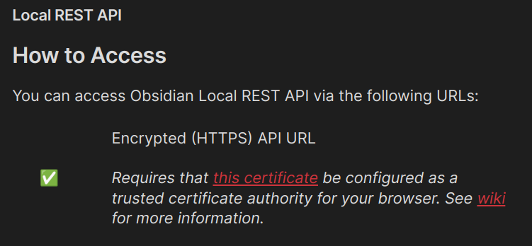
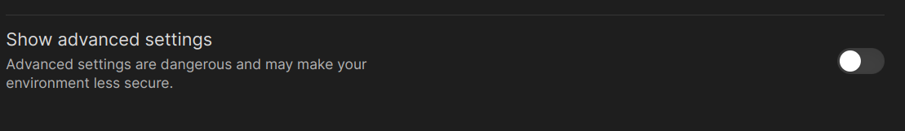
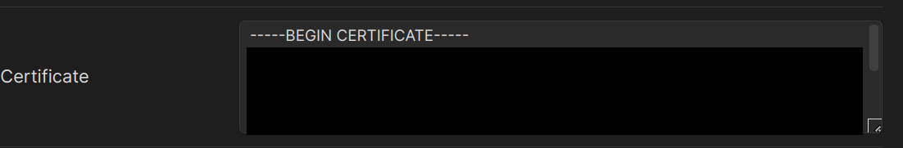

### :lotus_position: Purpose

[Obsidian](https://obsidian.md/) is great, but it doesn't offer the first-class Neovim experience that some of us just can't seem to do without. In the scenario where we edit notes in Neovim and view them rendered in Obsidian we would also like Obsidian to automatically follow navigation we do on the Neovim side.

That's where obsidian-bridge.nvim comes in. It mirrors navigation events in Neovim in the Obsidian app. If you open a note in Neovim the Obsidian App will show the same note automatically. If you navigate to another one or navigates to another Neovim buffer, the Obsidian app will show the corresponding note.

This is accomplished by leveraging the [Local REST API](https://github.com/coddingtonbear/obsidian-local-rest-api) plugin for Obsidian.

### :movie_camera: Demo


### :mechanic: Installation

1. Make sure you have [curl](https://curl.se/) installed on your system and available on your `PATH`.

2. Install and enable the [Local REST API](https://github.com/coddingtonbear/obsidian-local-rest-api) community plugin in Obsidian. <span style="color: red;">Important:</span> The default configuration of obsidian-bridge.nvim will try to connect to the non-encrypted server variant so remember to enable that in the [Local REST API](https://github.com/coddingtonbear/obsidian-local-rest-api) settings if you want to use it. _See SSL/HTTPS Setup below for more information._

3. Set the environment variable `OBSIDIAN_REST_API_KEY` to the API key found in the [Local REST API](https://github.com/coddingtonbear/obsidian-local-rest-api) settings within Obsidian. For example:

```bash
# In your .bashrc or .zshrc
export OBSIDIAN_REST_API_KEY="your_api_key_here"
```

<!-- TODO: Add link to instructions for storing the key securely for users that commit their dotfiles to git. -->

4. Install `obsidian-bridge.nvim`, here are examples for some popular package managers:

<details>
  <summary>Lazy</summary>

```lua
{
  "oflisback/obsidian-bridge.nvim",
  opts = {
    -- your config here
  },
  event = {
    "BufReadPre *.md",
    "BufNewFile *.md",
  },
  lazy = true,
  dependencies = {
    "nvim-lua/plenary.nvim",
  },
}
```

</details>

<details>
  <summary>Packer</summary>

```lua
require('packer').startup(function()
    use {
      'oflisback/obsidian-bridge.nvim',
      requires = { "nvim-telescope/telescope.nvim" }
      config = function() require('obsidian-bridge').setup() end
      requires = {
        "nvim-lua/plenary.nvim",
      },
    }
end)
```

</details>

<details>
  <summary>vim-plug</summary>

```vim
Plug 'nvim-telescope/telescope.nvim'
Plug 'oflisback/obsidian-bridge.nvim'
  Plug 'nvim-lua/plenary.nvim'
```

</details>

### :gear: Configuration

You have access to some configuration options. The table below represents the **default** settings. They will be used if you don't provide any settings.

You may pass a config table as the argument to the `setup` function, _or_ set it as the `opts` field **iff** you are using `lazy.nvim`. Any given settings will **override** the defaults. Untouched defaults will be kept.

If you change the server's address inside the Obsidian Local REST API settings, you _must_ set the correct `obsidian_server_address` in this plugin. If you wish to use SSL, you also need to pass a different address. When passing the address, make sure to copy it _directly_ from Obsidian into your `obsidian-bridge` configuration. Take care to **not** have any trailing slashes `/` after the port number!

```lua
-- default settings
local bridge_settings = {
  obsidian_server_address = "http://localhost:27123",
  scroll_sync = false, -- See "Sync of buffer scrolling" section below
  cert_path = nil, -- See "SSL configuration" section below
  warnings = true, -- Show misconfiguration warnings. Recommended to keep this on unless you know what you're doing!
}

-- If you are using lazy in your config,
-- for example in lua/plugins/bridge.lua
return {
  "oflisback/obsidian-bridge.nvim",
  dependencies = { "nvim-telescope/telescope.nvim" },
  opts = bridge_settings,
  event = {
    "BufReadPre *.md",
    "BufNewFile *.md",
  },
  lazy = true,
}

-- Or you may call setup directly:
require("obsidian-bridge").setup(bridge_settings)
-- Note: There's nothing special about the bridge_settings variable.
-- You can pass a table directly if you prefer.
```

### :key: SSL/HTTPS Setup

#### Saving The Certificate

To use an encrypted connection, you will need the CA certificate from the Local REST API plugin. This is because the plugin's certificate is self-signed, and we must instruct `curl` to treat it as a trusted certificate authority.

> Note: The name and extension of the certificate file does not matter as long as its contents are correct!

##### Save Directly

You can find it under the Local REST API settings panel in Obsidian. Simply click the "this certificate" link as seen below to save the certificate file:



Next, move the file to any location on your system, and **remember the path** because you will need it for the next step. \_It is not recommended to store it among your dotfiles if you track them with `git`, `~/.ssl/obsidian.crt` works well.

##### Copy Into File

In certain Linux environments, the above link _might_ not do anything. In that case, you can copy the certificate's contents from the settings panel directly. You need to enable the "Advanced Settings" option at the bottom of the settings panel:



Next, scroll to the bottom and look for the `Certificate` field. Take care to select the **entire** contents of the text box and copy it to your clipboard **without** modifying it.



Then, simply create a new file anywhere on your system (`~/.ssl/obsidian.crt` works well), and paste the certificate inside of it. As above, remember this path!

#### Configuring `obsidian-bridge`

Now that you've saved the certificate, you need to point `obsidian-bridge` to the correct HTTPS server address. The default address is shown below, and you can also find it in the REST API settings panel labeled "Encrypted (HTTPS) API URL". Please note that `localhost` will **not** work for SSL, and you **must** replace it with `127.0.0.1`!

You also must set the `cert_path` option to the _full_ path to the certificate file you saved in the previous step:

```lua
opts = {
    obsidian_server_address = "https://127.0.0.1:27124",
    cert_path = "~/.ssl/obsidian.crt",
}
```

SSL should now be ready to use. `obsidian-bridge` will warn you about any detected misconfigurations when it's loaded.

### :keyboard: Commands

- `:ObsidianBridgeDailyNote` takes you to your daily note or generates it for you if it doesn't already exist. Make sure to have the Daily Notes core plugin enabled in Obsidian for this to work. Since it internally uses the Daily Note plugin to create the note for you, templates will work the same way as if it was triggered from within Obsidian.
- `:ObsidianBridgeOpenGraph` opens the graph view in Obsidian, as long as the Graph core plugin is enabled.
- `:ObsidianBridgeOpenVaultMenu` opens the Obsidian vault selection dialog. Obsidian does not expose a way to switch to another vault programmatically (yet?).
- `:ObsidianBridgeTelescopeCommand` lists all the executable commands in Telescope. Execute the selected one.
- `:ObsidianBridgeOn` activate plugin.
- `:ObsidianBridgeOff` deactivate plugin, this will prevent calls towards Obsidian.
- `:ObsidianBridgeToggle` toggle plugin active/inactive.

:bulb: Feel free to suggest additional useful commands via issue or PR.

### :scroll: Sync of buffer scrolling

Ideally scrolling within a note in neovim should also make the scroll position be centered in Obsidian. This is possible, but requires a patched version of [Local REST API](https://github.com/coddingtonbear/obsidian-local-rest-api) so we'll have to build it ourselves. For more info about the patch's status see this [discussion](https://github.com/coddingtonbear/obsidian-local-rest-api/discussions/75).

#### Two ways of doing this, either use BRAT build or build the forked version

##### A) Use BRAT to install my forked version of obsidian-local-rest-api

1. Install the Obsidian [BRAT](https://github.com/TfTHacker/obsidian42-brat) plugin.

2. In the settings for BRAT, select "Add beta plugin with frozen version".

3. Add `https://github.com/oflisback/obsidian-local-rest-api` with release version tag `v1.0.0`. The added plugin is called "Local REST API with scroll".

##### B) Build a forked version of obsidian-local-rest-api

Specifically what's required is a build based on [this fork](https://github.com/coddingtonbear/obsidian-local-rest-api/compare/main...oflisback:obsidian-local-rest-api:main) which hopefully can get integrated in the upstream project eventually.

Start off by cloning the [patched fork](https://github.com/oflisback/obsidian-local-rest-api) to a folder named obsidian-local-rest-api-with-scroll:

```
git clone https://github.com/oflisback/obsidian-local-rest-api obsidian-local-rest-api-with-scroll
```

Then do `npm install` followed by `npm run build` inside that folder.

Now that you've built your own version of the plugin, place the obsidian-local-rest-api-with-scroll in your vault's `.obsidian/plugins/` folder and enable the "Local REST API with Scroll" plugin in the Obsidian settings panel.

#### After either completing (A) or (B)

The final thing to do is to set `scroll_sync = true` in your obsidian-bridge.nvim configuration and update the `OBSIDIAN_REST_API_KEY` value to what was generated for the new version of the plugin.

Now scrolling a note in neovim should also result in scrolling in Obsidian. Note however that this only works if the note is in <b>editing mode</b> in Obsidian. Any suggestions on how to make it work also in view mode would be very appreciated, until then make sure that notes are opened in editing mode by default via the Obsidian setting Editor -> Default view for new tabs -> Editing view.

### :books: Other projects for Neovim + Obsidian

- [obsidian.nvim](https://github.com/epwalsh/obsidian.nvim) Lets us interact with Obsidian vaults directly via the filesystem. :brain:

### :people_holding_hands: Contributing

Contributions, bug reports and suggestions are very welcome.

If you have a suggestion that would make the project better, please fork the repo and create a pull request.
